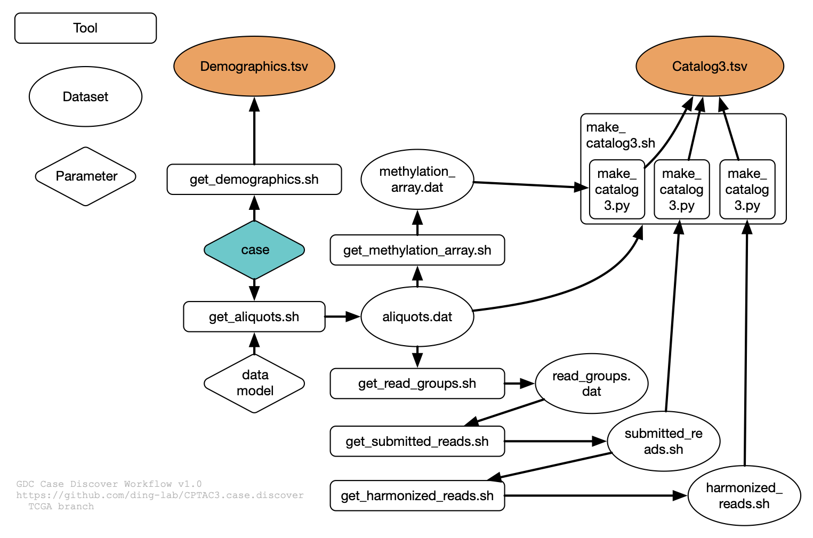

# GDC Case Discover

GDC Case Discover is an update to the CPTAC3-specific implementation, CPTAC3 Case Discover.
* Uses python-based JSON parser
* Revised aliquot annotation parsing
* Generates Catalog v3 files [defined here](https://docs.google.com/document/d/1uSgle8jiIx9EnDFf_XHV3fWYKFElszNLkmGlht_CQGE/edit#)

Query GDC to discover sequence and methylation data and write it to a catalog file



## Quick start

* Obtain token from GDC, save to file `gdc-user-token.txt`
    * make this available as global variable with, `export GDC_TOKEN=gdc-user-token.txt`
* `git clone --recurse-submodules https://github.com/ding-lab/CPTAC3.case.discover PROJECT_NAME`
* edit `1_process_all.sh`
* run `bash 1_process_all.sh`

Discuss v3.0 Cataog file


# User's Manual

## Installation

Other packages which need to be installed:
* `python` and `json` library; these typically come installed in a developer environment.
    * TODO provide explicit instructions
* `jq` : [see here for installation instructions](https://stedolan.github.io/jq/download/).

Note that [`bashids`](https://github.com/benwilber/bashids) is also used, but this is installed during `git clone` as a submodule.

## Usage

### Project configuration

All CPTAC3.case.discover code code can be obtained with,
``` 
git clone https://github.com/ding-lab/CPTAC3.case.discover PROJECT_NAME
```

Edit `README.project.md` to provide project-specific descriptions.  This file is typically not committed to git.

The file `1_process_all.sh` defines several locale-specific environment variables and paths, and must be edited as appropriate.

Create file `dat/cases.dat` listing all cases to be processed.

### Obtaining GDC token

All queries require a GDC authorization token, [as described
here](https://docs.gdc.cancer.gov/Data_Submission_Portal/Users_Guide/Authentication/).

* Log in to [GDC Data Submission Portal](https://portal.gdc.cancer.gov/submission/CPTAC/3/dashboard)
* Download token, and save it to some filename, e.g. `gdc-user-token.txt`.
* Update `GDC_TOKEN` in `1_process_all.sh` accordingly

# File output format

## Catalog file

Catalog file columns:

1. `sample_name` - ad hoc name for this file, generated for convenience and consistency
2. `case`
3. `disease`
4. `experimental_strategy` - WGS, WXS, RNA-Seq, miRNA-Seq, Methylation Array, Targeted Sequencing
5. `short_sample_type` - short name for `sample_type`: `blood_normal`, `tissue_normal`, `tumor`, `buccal_normal`, `tumor_bone_marrow`, `tumor_peripheral_blood`:w
6. `aliquot` - name of aliquot used
7. `filename`
8. `filesize`
9. `data_format` - BAM, FASTQ, IDAT
10. `result_type` - ad hoc value specific to sample type
    * "chimeric", "genomic", "transcriptome" for RNA-Seq BAMs, 
    * "Red" or "Green" for Methylation Array
    * "NA" otherwise
11. `UUID`
12. `MD5`
13. `reference` - assumed reference used, hg19 for submitted aligned reads, NA for submitted unaligned reads, and hg38 for harmonized reads
14. `sample_type` - sample type as reported from GDC, e.g., Blood Derived Normal, Solid Tissue Normal, Primary Tumor, and others
15. `sample_id` - GDC sample name  
16. `sample_metadata` - Ad hoc metadata associated with this sample.  May be comma-separated list
     - see updates below
17. `aliquot_annotation` - Annotation note associated with aliquot, from GDC 

Example catalog file...

### Sample names

Sample names are ad hoc names we generate for convenience.  They indicate the case, experimental strategy, 
sample type, whether data are harmonized (`hg38`) and any aliquot annotation codes.  Examples include,

See Catalog v3 file

See Heterogeneity Studies below for information about labels like `HET_qZq3G`.

### Sample types

The `sample_type` column lists GDC sample types.  We abbreviate these names in the sample name and `short_sample_type` column respectively as,
* Blood Derived Normal: N, blood_normal
* Buccal Cell Normal: Nbc, buccal_normal
* Primary Tumor, Tumor: T, tumor
* Primary Blood Derived Cancer - Bone Marrow: Tbm, tumor_bone_marrow
* Primary Blood Derived Cancer - Peripheral Blood: Tpb, tumor_peripheral_blood
* Solid Tissue Normal: A, tissue_normal
* Recurrent Tumor: R, recurrent_tumor

## Heterogeneity Studies and duplicates

GDC provides annotations associated with aliquots which contain additional
context regarding cases with multiple tumor samples.  This information is
stored in the field `aliquot_annotation` and is used to generate a convenient
label used in the sample metadata and sample name fields.

If `aliquot_annotation` is defined for a given data file, we generate sample
label consisting of a label prefix followed by an ID code.  For CPTAC3, an example sample
label may be `HET_qZq3G`, where the prefix `HET` indicates heterogeneity and
the ID code is `qZq3G`.  This code is hash ID generated with
[bashids](https://github.com/benwilber/bashids), where the input numerical
string is obtained from the aliquot name (`CPT0000650008`) with "CPT" and any
leading 0's removed.  The sample label used for the `sample_name` and
`sample_metadata` fields

Table below lists all known GDC aliquot annotations, and 
the prefix used to generate the sample label.

| Aliquot annotation | Label prefix |
| ------------------ | ------------ |
| Additional DNA Distribution - Additional aliquot | ADD
| BioTEXT_RNA | BIOTEXT 
| Duplicate item: Additional DNA for PDA Deep Sequencing | DEEP | 
| Duplicate item: Additional DNA requested | ADNA
| Duplicate item: Additional RNA requested | ARNA
| Duplicate item: CCRCC Tumor heterogeneity study | HET | 
| Duplicate Item: CHOP GBM Duplicate Primary Tumor DNA Aliquot | ADNA
| Duplicate Item: CHOP GBM Duplicate Primary Tumor RNA Aliquot | ADNA
| Duplicate Item: CHOP GBM Duplicate Recurrent Tumor DNA Aliquot | ADNA
| Duplicate Item: CHOP GBM Duplicate Recurrent Tumor RNA Aliquot | ADNA
| Duplicate item: No new shipment/material. DNA aliquot resubmission for Broad post-harmonization sequencing and sample type mismatch correction. | RDNA
| Duplicate item: PDA BIOTEXT DNA | BIOTEXT
| Duplicate item: PDA Pilot - bulk-derived DNA | BULK
| Duplicate item: PDA Pilot - core-derived DNA | CORE
| Duplicate item: Replacement DNA Distribution - original aliquot failed | RDNA
| Duplicate item: Replacement RNA Aliquot | RRNA 
| Duplicate item: Replacement RNA Distribution - original aliquot failed | RRNA
| Duplicate item: UCEC BioTEXT Pilot | BIOTEXT
| Duplicate item: UCEC LMD Heterogeneity Pilot | LMD
| Original DNA Aliquot | ODNA
| Replacement DNA Aliquot | RDNA
| This entity was not yet authorized to be released by the submitters | UNAV
| unknown | UNK | 

All this is outdated

## Demographics

The following clinical information is recorded in the file `dat/PROJECT.Demographics.dat` for each case:

    * case
    * disease
    * ethnicity
    * gender
    * race
    * days to birth

## Catalog Summary Files

Catalog summary files provide a one-line representation of data available for a given case on GDC.  Following case and disease, each column represents 
a particular data type, and one-letter codes T, N, A indicate availability of tumor, blood normal, and tissue adjacent normal samples, respectively.
Repeated codes indicate repeated data files.

### Example
```
C3L-00001   LUAD        WGS.hg19 T N A      WXS.hg19 T N A      RNA.fq TT  AA       miRNA.fq T  A       WGS.hg38 T N A      WXS.hg38 T N A      RNA.hg38 TTT  AAA       miRNA.hg38 T  A     MethArray TT  AA
```
This line indicates that LUAD case C3L-00001 has tumor, blood normal, and adjacent normal samples for WGS and WXS data as submitted (hg19);
tumor and adjacent normal RNA-Seq data (TT, AA because FASTQ data comes in pairs); and tumor and adjacent miRNA data in FASTQ format.  All
these are available as harmonized hg38 WGS and WXS, and harmonized hg38 RNA-Seq chimeric, genomic, and transcriptome BAMs are available
for tumor and adjacent normal.  Methylation array data for tumor and tissue adjacent also available (Green and Red channel for each).

## Exon target capture info

The intermediate files `cases/*/read_groups.dat` capture the `target_capture_kit_target_region` field of each read group, which is used for exome analysis.  Currently the
only value observed (apart from null and "Not Applicable") is,
```
http://support.illumina.com/content/dam/illumina-support/documents/documentation/chemistry_documentation/samplepreps_nextera/nexterarapidcapture/nexterarapidcapture_exome_targetedregions_v1.2.bed
```

# Processing details

## Workflow

Processing workflow and hierarchy proceeds as,
* `1_process_all.sh`
    * All project-specific definitions take place here
    * Calls `src/process_multi_cases.sh`, which 
        * Iterates over cases file
        * Calls `src/process_case.sh` for each case
        * `src/process_case.sh`  Calls the following:
            * `src/get_aliquots.sh`
            * `src/get_read_groups.sh`
            * `src/get_harmonized_reads.sh`
            * `src/get_methylation_array.sh`
            * `src/make_catalog.sh`
            * `src/get_demographics.sh`
        * Collects catalog files to write project catalog file
        * Collects demographics files to write project demographics file

[queryGDC documentation](README.queryGDC.md) includes additional information about GDC queries
and other useful links.

# Support 

Please contact Matt Wyczalkowski <m.wyczalkowski@wustl.edu> for with questions and bug reports.
